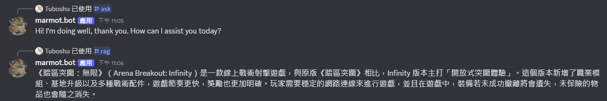

# Discord-AI-Assistant
An Intelligent Chatbot Integrating OpenAI API with Discord for Real-Time Conversations

💬 Discord AI Assistant

Integrating OpenAI API for Real-Time Chat, RAG, and Automation

A smart Discord chatbot powered by OpenAI that supports real-time conversations, Retrieval-Augmented Generation (RAG), slash commands, and lightweight automation.
It helps communities and developers reply, summarize, and manage conversations with ease.

🧠 Project Motivation

As LLMs become mainstream, I wanted to explore how an assistant can live inside a social platform and deliver value immediately.
This project shows how to connect Discord ↔ OpenAI, add knowledge retrieval (RAG) for custom docs, and ship a production-like bot with clear setup and safety practices.

🚀 Features

✅ Real-time AI Conversations — Natural and fast GPT-based replies

✅ Slash Commands — /rag, /ask, /summarize ready for expansion

✅ RAG (Retrieval-Augmented Generation) — Answers questions based on your uploaded PDFs or text files

✅ Context Memory (Optional) — Keeps recent messages per channel for better continuity

✅ Embeds & Replies — Clean message formatting and rate-limit control

✅ Cross-Platform RAG — Uses NumPy cosine similarity (no FAISS dependency)

✅ Secure by Design — Environment variables, safe prompts, minimal permissions

🧩 Tech Stack
| Layer              | Technology                              |
| ------------------ | --------------------------------------- |
| **Backend**        | Python 3.11+, `discord.py`, `aiohttp`   |
| **LLM**            | OpenAI GPT-4o / GPT-4o-mini             |
| **RAG Engine**     | NumPy cosine similarity (vector search) |
| **Documents**      | `.pdf`, `.txt` (via `pypdf`)            |
| **Environment**    | `.env`, `python-dotenv`                 |
| **Optional Tools** | Docker, PM2, GitHub Actions             |

📦 Project Structure

.
├─ bot.py                # Discord bot (slash + mention)
├─ rag_index.py          # Build embeddings for docs (offline step)
├─ rag_module.py         # Runtime retrieval + answer
├─ requirements.txt
├─ .env.example          # Sample env vars (copy to .env)
├─ docs/                 # Put your PDF/TXT here
├─ rag_store/            # Generated vectors + metadata
└─ assets/               # demo.gif / architecture.png (added in step 3)

⚙️ Setup Guide
1️⃣ Create a Discord Application

1.Go to Discord Developer Portal

2.Create New Application → Bot → Add Bot

3.Copy your Bot Token

4.Under “Privileged Gateway Intents” → enable Message Content Intent

5.Go to OAuth2 → URL Generator

  Scopes: bot, applications.commands

  Permissions: Read Messages/View Channels, Send Messages

2️⃣ Environment Variables

Create a .env file (or copy .env.example):
DISCORD_BOT_TOKEN=your_discord_token
OPENAI_API_KEY=your_openai_key
OPENAI_CHAT_MODEL=gpt-4o-mini
OPENAI_EMBED_MODEL=text-embedding-3-small

RAG_INDEX_DIR=./rag_store
DOCS_DIR=./docs
SYSTEM_PROMPT=You are a helpful assistant.

3️⃣ Installation
python -m venv .venv
# Activate virtual environment
# Windows:
.venv\Scripts\activate
# macOS/Linux:
source .venv/bin/activate

pip install -r requirements.txt

4️⃣ Build RAG Index

Put your .pdf or .txt files into the ./docs/ directory, then run:
python rag_index.py

Once completed, you’ll have:
rag_store/vectors.npy
rag_store/meta.pkl

5️⃣ Run the Bot
python bot.py

💬 Usage
Slash Commands

/rag query:<your question> → Retrieves from your uploaded documents

/ask question:<your question> → Direct conversation

/summarize → Summarize channel or uploaded text

Text Triggers (optional)

!rag your question

Mention the bot directly @YourBot What is ...?

🧠 How RAG Works

1.rag_index.py splits your local documents into small chunks, sends them to OpenAI Embeddings API, and stores normalized vectors (vectors.npy) with metadata (meta.pkl).

2.rag_module.py embeds each incoming query and computes cosine similarity (X @ q) to find the top relevant chunks.

3.Those chunks are appended as context to the OpenAI Chat API request.

4.The model generates grounded answers, avoiding hallucination if no relevant context exists.

🧪 Testing
API Connectivity Test

Create tests/test_openai.py:
import os
from openai import OpenAI

def test_chat_minimal():
    client = OpenAI(api_key=os.getenv("OPENAI_API_KEY"))
    r = client.chat.completions.create(
        model=os.getenv("OPENAI_CHAT_MODEL", "gpt-4o-mini"),
        messages=[{"role": "user", "content": "ping"}],
    )
    assert r.choices[0].message.content
    
Run:
pytest -q

Quick RAG Test
python rag_index.py
python - << 'PY'
from rag_module import RAG
import asyncio
async def run():
    rag = RAG()
    print(await rag.answer("What does the document mention about the main topic?"))
asyncio.run(run())
PY

💰 Cost & 🔐 Security
Cost Estimation

Embeddings (text-embedding-3-small) — extremely cheap (fractions of a cent per 1K tokens)

Chat (gpt-4o-mini) — fast and affordable for conversational and RAG tasks

Run initial tests in a small server or local environment to observe actual token usage.

Security Practices

🔒 Keep secrets only in .env — never commit it (.gitignore already covers it)

🛑 Give your bot the minimum permissions required

⚙️ Add rate limits to prevent spam and cost spikes

🧠 The RAG system prompt explicitly says “If unknown, say you don’t know” to prevent hallucination

🚫 Do not upload confidential or private documents unless self-hosting your vector store

🧩 Troubleshooting
| Issue                       | Solution                                                          |
| --------------------------- | ----------------------------------------------------------------- |
| `ModuleNotFoundError`       | Activate venv → `pip install -r requirements.txt`                 |
| Slash command not appearing | Wait 1–2 minutes or check `await tree.sync()` inside `on_ready()` |
| Replies too slow            | Reduce model size (`gpt-4o-mini`) or shorten documents            |
| “RAG index not built”       | Run `python rag_index.py` after placing docs in `./docs/`         |
| Permission error            | Re-invite the bot with correct scopes in OAuth2 URL               |

🗺️ Roadmap

 OCR for image-based PDFs

 /upload command for rebuilding RAG index dynamically

 Voice mode (Speech-to-Text + TTS)

 Admin tools (filters, moderation, rate limits)

 Dockerfile & GitHub Actions CI pipeline

 📸 Demo / Architecture (Step 3 Placeholder)

To be added in Step 3 (assets/demo.gif and assets/architecture.png).

Architecture Overview

Discord Gateway → bot.py (events & commands)
          │
          ▼
   OpenAI Chat API  ←→  rag_module.py  ←→  vectors.npy + meta.pkl
          ▲
          │
   rag_index.py (offline index builder)
          │
        docs/ (PDF & text sources)

🧾 License

MIT License © 2025 EN

Suggested Commit Messages

docs: update README with RAG, tests, and security section

feat(rag): add numpy-based retrieval and /rag command

chore: add .env.example and demo placeholders
